# A Pragmatic View of Reactive

* **Conference: [Scala Days Amsterdam 2015](http://event.scaladays.org/scaladays-amsterdam-2015) - June 2015**
* **Video: [https://www.youtube.com/watch?v=aWQewAFMbgo](https://www.youtube.com/watch?v=aWQewAFMbgo)**

This is about the experience of moving to reactive from whatever your previous domain was. For me, I've been a Java Developer for 15 years. An Enterprise Java developer, using Java EE a lot, and then you develop a couple of habits. Moving to another platform is a kind of transition. Something that might have been valuable experience I had on a previous setup is now a bad habit, because it doesn't really transform. You might be very skilled in PostgreSQL and defining data models. But then you move to Cassandra, and if you apply the same techniques, want to define foreign keys and joins, you Cassandra data model is not going to be good, it's not going to be performant.

And this of course is the same thing with reactive and reactive programming. If you apply the same patterns and the same ideas or maybe even habits you have from straightforward Java EE programming, then you'll run into a couple of problems, or you'll hit a wall. There's things you need to be aware of.

So this morning I came up with the final and best title for this talk, this is the title I would submit now if I was to submit it again, I would say it's a "Pragmatic View of Reactive". I want to look at reactive programming, or the reactive manifesto, but on a coder level, on a level that I think on. Because the first time I saw the reactive manifesto..

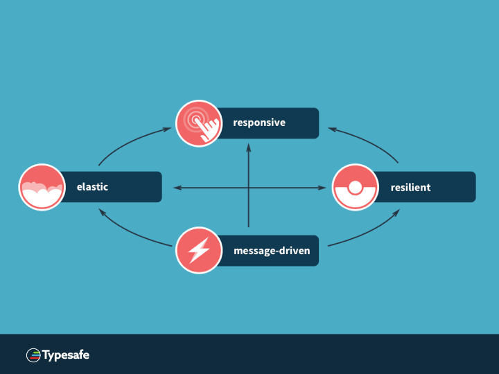

(you've seen it, I hope. If you haven't, go to reactivemanifesto.org and read it now. It's very central to everything we do at Typesafe. Reactive Systems are not our religion, but we think they are the solution to many problems, and it should be the way you build systems today).

What might happen to you if you read the Reactive Manifesto, though, is that you think the same way that I do: 

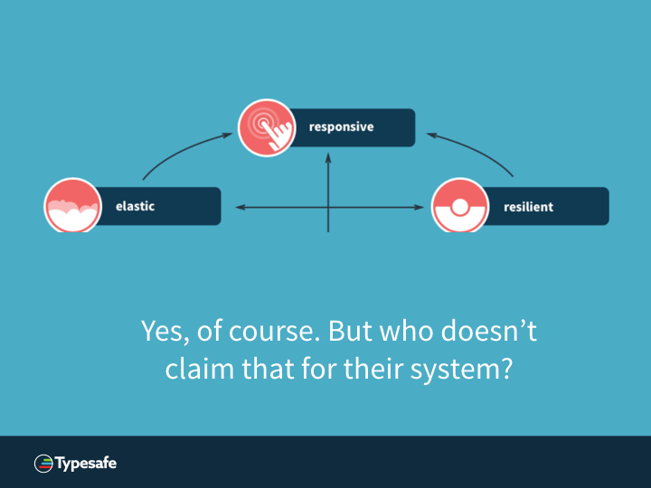

You see the Reactive Manifesto and of course you don't time to read all of it right now, so you look at the picture, the four reactive traits: Responsiveness, Elasticity, Resilience, and it's all Message Driven.
And you look at it and you think "ok, that's all marketing, that's not something that speaks to me as a developer". Every single system vendor will claim that their system is elastic and resilient. If Oracle want to sell me a WebLogic Server, they're going to say "Yes, it's super scalable, you can have a super cluster set up, all fail-safe, don't worry about that", and IBM will say the same of course, anybody will. So this claim doesn't really distinguish reactive from anything else.

And then there's the last one, message driven.

That's a bit of a big leap. We have these three very abstract traits on the top, and then it's - message driven. Right. So I'm supposed to use Akka apparently. Right..

So the questions that come up in development, or in fact questions that we get from users, are in a different problem space. We get questions like these:

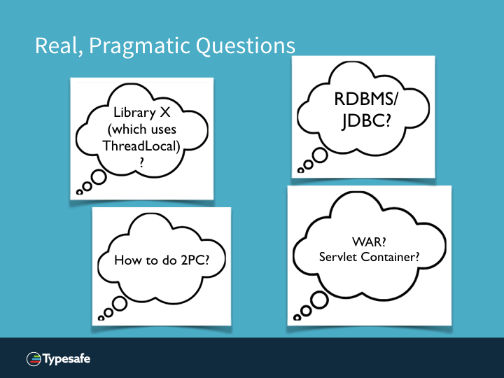

How do I deploy my stuff? Do I still build a .war, do I run it in an application server?

How do I do database connectivity now in an asynchronous setup?

I use this library, and it doesn't work any more, it doesn't do what I expected. Maybe because it uses ThreadLocals? I used to sl4j's Mapped Diagnostic Context, and now suddenly it doesn't really work anymore like you expected. Or you use Spring Security, or other things- a lot of libraries store things in ThreadLocal, we're going to come back to that).

And the customer says it's a requirement we have this distributed transaction there, and now it's all async and messaging, and I have no idea how that relates.

So let look at these things. I think the topics that are actually interesting there are:

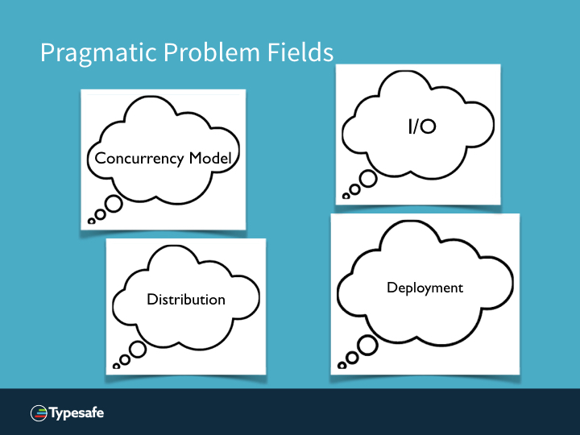

The concurrency model that's underlying all this.

How do we do I/O (that would include database I/O)

How do we deal with the whole distributed situation, because we don't want to build systems with a single point of failure or a single point of contention.

How do we deploy all that stuff?

So I present to you: The pragmatic reactive manifesto. Please don't take the title seriously.

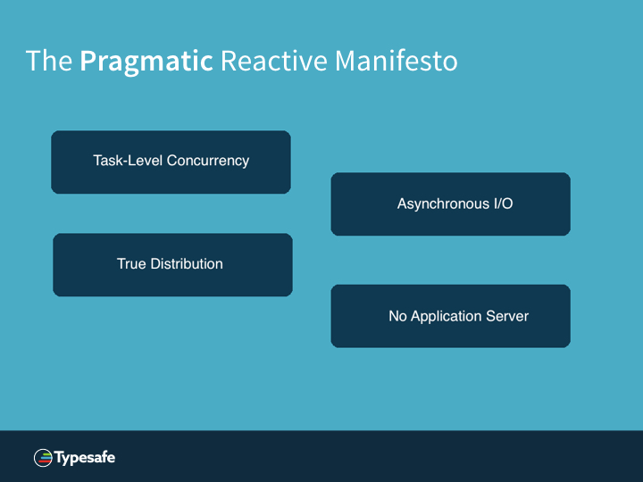

But from a pragmatists point of view, the traits you want to look for in your code are:

Task-Level Concurreny (sub-thread-level concurrency)
Asynchronous I/O
True distribution (no single point of failure or contention, like a single central database)
No Application Server(*)
So let's look at these four traits.

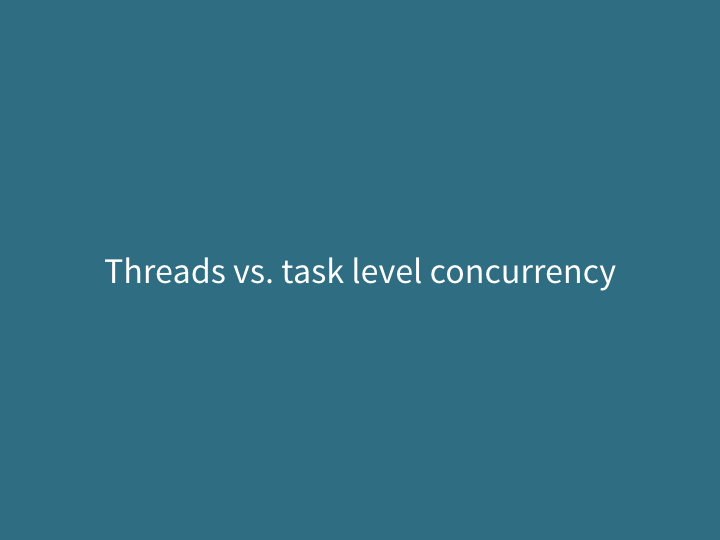
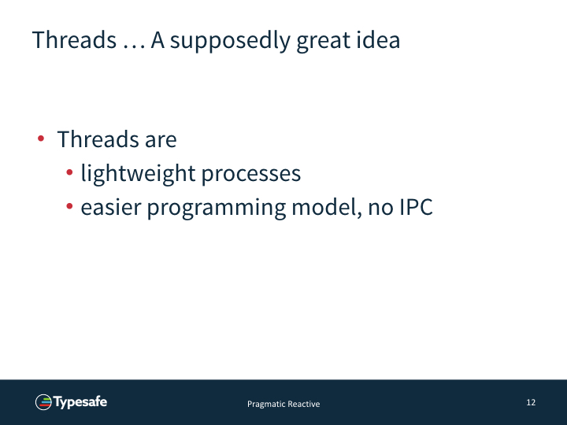

On the JVM, our basic concurrency model is the Thread. Why? It's a multi-threaded environment, and the JVM threads map to native threads, and that, at the time, seemed a pretty good idea.

Before that, there was multiple processes, and starting a new process for anything you want to do in parallel is rather heavyweight, and also you have a communication problem. You need Inter-Process Communication to exchange data between those processes. So people thought let's just use threading - that's going to be super lightweight, and also they can just share the same address space, they can just share the same memory and super easily communicate.

Well, that seemed to be a good idea at the time. By now, people don't believe that anymore.

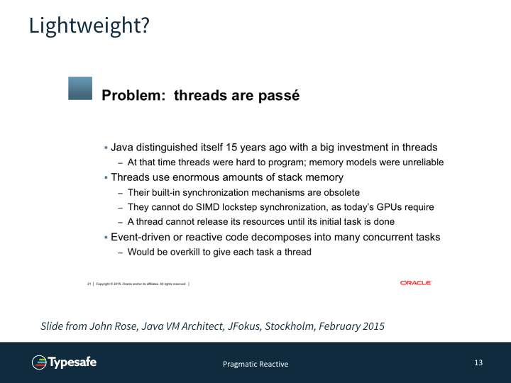

Threads - and this is not some Scala vs. Java thing, this is actually someone from Oracle saying this - are passé. We need to look beyond them.

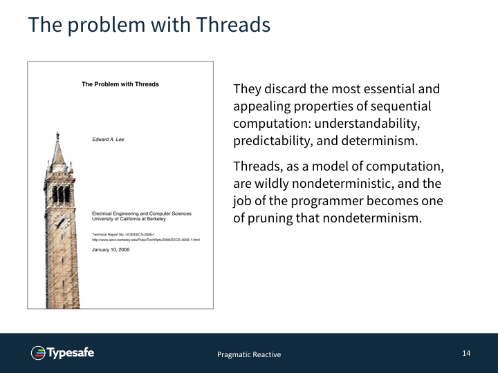

It's inefficient, it's heavyweight, and the shared memory thing actually makes concurrent programming rather difficult. You end up with something interwoven like this:

You start up nicely, I roll up my earbud cables nicely when I put them in my pocket, but everytime I get my earbuds out of the pocket, it's all intertwingled and complicated. And this is what happens to multi-threaded programs as well.

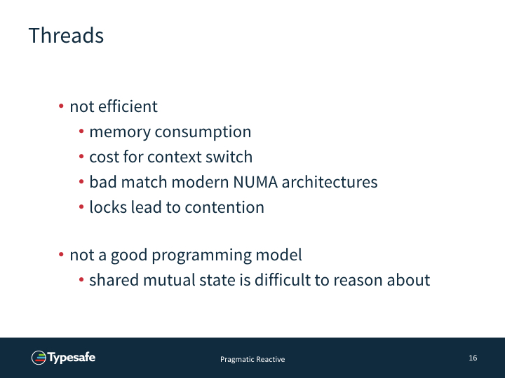

So threads are really not that efficient, especially memory consumption is pretty high. If we talk about JVM threads, the default stack size is 1MB on a 64bit JVM. So for each thread you start, you spend at least one Megabyte. So if you have 10000 threads, 10 GB are gone just for that. And then you have that whole switching thing, and in a modern CPU architecture, you have the non-uniform memory access with all the different cache layers on your processor and you really want to stick the  thread to the core. The ideal situation is where one thread just runs through on one core all the time and has all his working set on the processor cache. However when it blocks it's going to be kicked out by the system scheduler and it's going to loose all this context. Of course that doesn't kill you if it's about 20 or 30 threads, but if it's about 20 or 30 thousand it becomes an issue. As does the memory.

And the shared memory model of course has its problems because you need to synchronize on that somehow. Either you have race conditions because you don't and then you see oh this doesn't work, I have timing issues, so I need to lock on that. Locks lead to possible deadlock, or at least they lead to contention, while you have to wait to get a lock. So threads are not efficient, anymore, on modern hardware, on the scale we're talking about, and they're also not really a smart programming model, in terms of making it easy for you to write your program correctly in a multi-threaded environment.

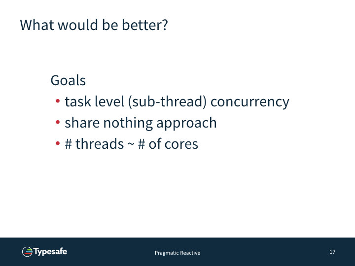

So what we want is concurrency on an even lighter level, on a sub-thread level ( a lot of people say "task level concurrency" as a generic term for that). 

And you want a "share nothing" approach, where you send immutable values around, so you don't have to worry about synchronization and locks.

And you want to optimize the number of threads you want to deal with. A small number of threads that corresponds not the number of tasks you have, but to the resources you have available. There's no point in having 10000 threads when you have 8 cores - you can't run more than 8 in parallel anyway. Imagine your threads never block, your work is 100% completely CPU bound, then why have more than 8 threads? That's what you can run in parallel, that's what you should have, then the threads can just run each on its core.

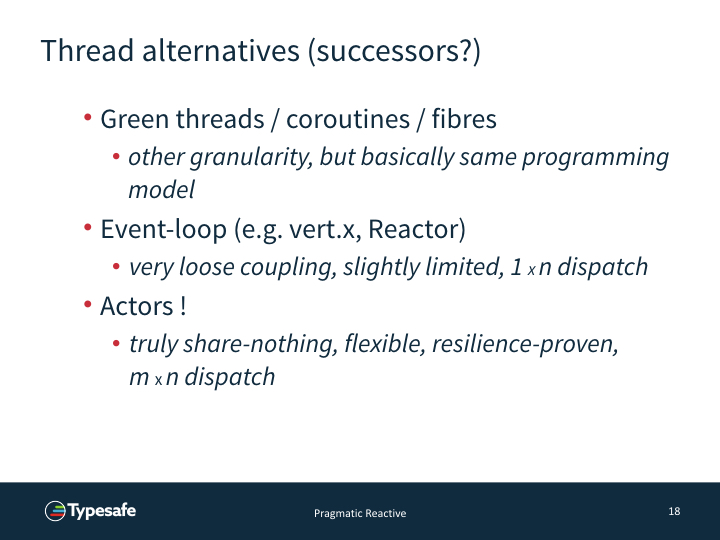

There are a couple of ways to approach this, a couple of competing models. 

The smallest step would be to keep the same programming model, the synchronized, sequential approach, but go sub-thread level. Like go does with goroutines, but that's of course not on the JVM. On the JVM, I think the closes implementation to that would be Fibers, but you still have basically the same programming model, you still usually share variables and have the locking and synchronization problem.

A step beyond that, to a different programming model, would be an event loop system, like vert.x or Reactor, where you put events in an event loop and they work on that.

And of course what I think is the most powerful system, actors. Actors give you even more flexibility because you can also address actors directly. You have the whole routing thing that Akka gives you, plus they have the resilience / supervision thing. From a dispatch point of view, it's also more flexible, in a traditional event loop system you really have one main thread for the events, while in Akka or Play you have an m x n mapping. You don't have 1 thread working on n tasks, but m threads working on n tasks. 

Let's look at a real world problem: You build a web application and you have incoming HTTP requests. If you've been a Java programmer and you've done Servlet programming, or JSF, Wicket, Spring MVC.. anything that runs on top of the Servlet API, the model how your code is going to be executed is basically going to be like this: Each request that comes in is going to pick a thread from the pool, and this thread is going to stick with the request, and when the request has been processed in a rather synchronous manner, then the thread is going to be returned to the pool. If you have 10 concurrent requests in a traditional thread-per-request model, then 10 threads are going to be used. This gives you a lot of simplicity in a way, because you can rely on the sequential execution of your code in the thread, and you can use a ThreadLocal for example (and this is why all those Java libraries do that). You can just put some context in the ThreadLocal and you know, this is going to be my thread, I'm going to run on this thread, and I can clean it up at the end, and until then keep this context all through my call stack.

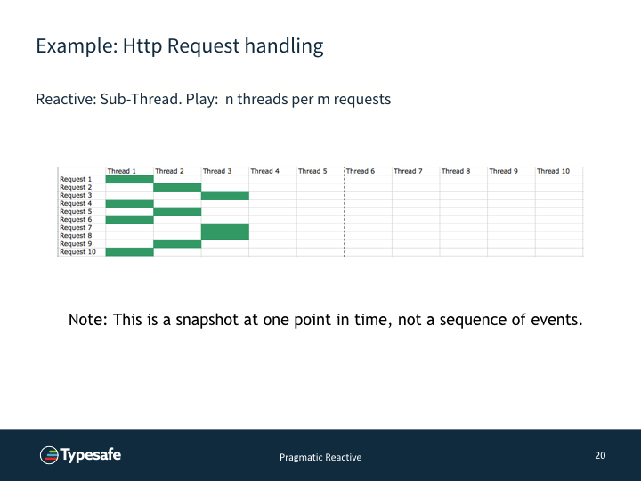

If you go to a sub-thread level concurrency model, though, that doesn't work anymore. 

If you now take a snapshot - of course this is a bit simplified, because you get the requests in, actions are created, put in a queue, and then workers work on them), but if you look at the threads, and which requests theses threads might work on, you definitely have some sharing there. You don't have the thread-per-request model, you have n requests for m threads. In this case only 3 threads are used, but they are still working on 10 requests. These requests would then just be sharing ThreadLocals. Also, we're going for a more asynchronous model of executions, we might be using Futures with different ExecutionContexts, so this whole ThreadLocal thing will not work anymore. 

What are the consequences of this? If you use for example Akka or Play, you're switching to a different concurrency model. I think we're not explicit enough in the documentation, especially in Play - some people believe if they don't use async in Play, it's still thread-per-request and all synchronous.Play is asynchronous by default and will not attach a thread to a request. Instead they'll be queued and a thread pool that you define will work on them. So you have to be aware that you're switching to a different concurrency model, and that ThreadLocal becomes an anti-pattern. You'd have to do a lot of extra work to still use it. If you still want to use slf4j's MappedDiagnosticContext, you have to patch your ExecutionContext to hand over the context in an async manner to the other thread, to the thread that passes off the execution has to hand it over to another thread, and it becomes even more complicated in real distributed execution for example with Akka, where you'd have to add an envelope to the message and push the context over with the message. I really advise you to avoid anything with ThreadLocals.

There are other approaches to carry your context across async boundaries, for example Typesafe Monitoring.

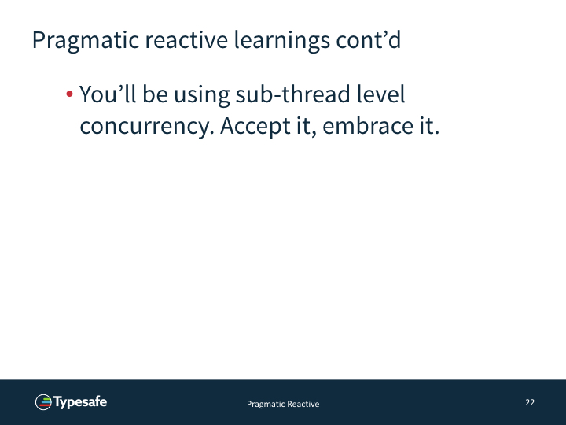

You'll be using sub-thread level concurrency. Accept it, embrace it.

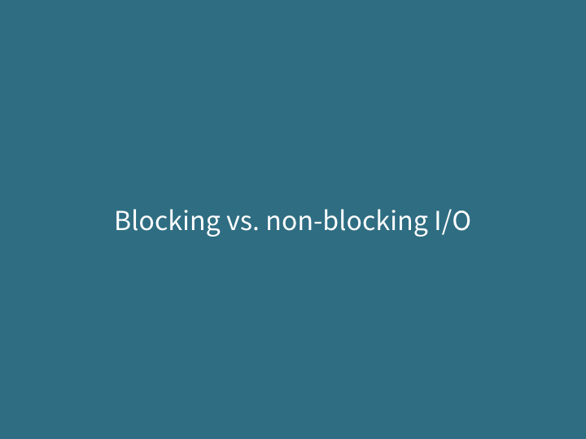
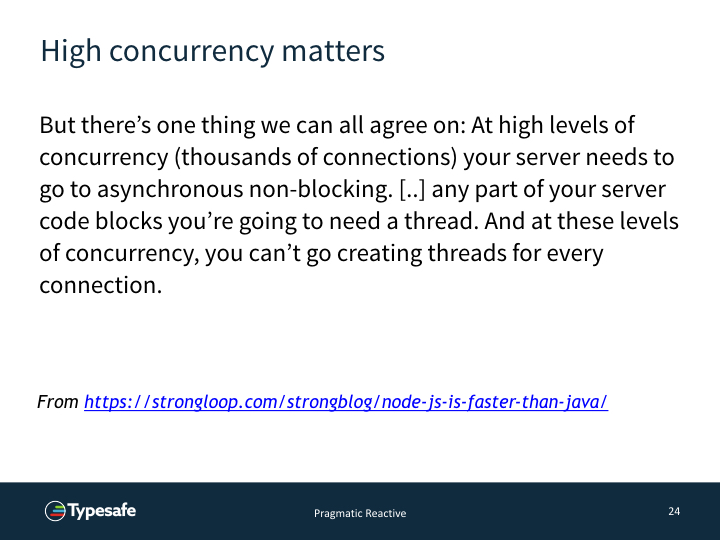

So if you want to use less threads, it becomes super reasonable to use asynchronous I/O. Asynchronous I/O became super popular with node.js. node.js was very efficient and could handle like 10000 concurrent requests on a single core CPU or whatever - and with a single thread, which was quite impressive I think, at the time. And the way they did that was that they leveraged the operating system facilities that actually allow you to load off all the I/O work from the CPU. It will run on the I/O controllers on I/O threads, but it will not use up your kernel threads.

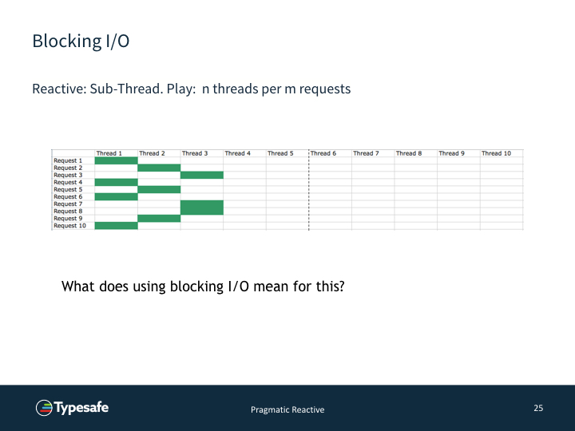

If you don't, if you're used to using blocking I/O from the Java world, java.io.File or whatever, and if you remember this situation: We have our m threads, and each of these threads is responsible for n requests. What happens if we block one of these threads?
In a thread-per-request model, if we block one of the threads, this thread is responsible for one request, so if we block the thread, this one request will be affected.
But here, the number of request that we handle with a single thread can become pretty big. The extreme case would be having just one thread, an event-loop thread, and if you block this thread, everything comes to a halt.

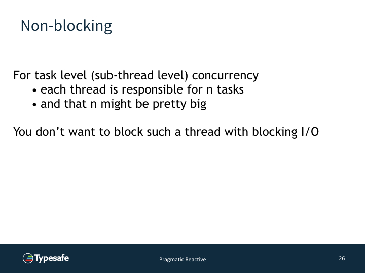

If you go sub-thread level, you don't want to block your threads on I/O. If you have CPU bound work that has to be done, then that has to be done.
For I/O, you really don't have to block. You can use aynchronous networking, there are libraries available, you can use asynchronous file I/O, and that's really what you should do. Keep you thread pool ready for the incoming requests and for the CPU bound work. 

But now you say, what about this:

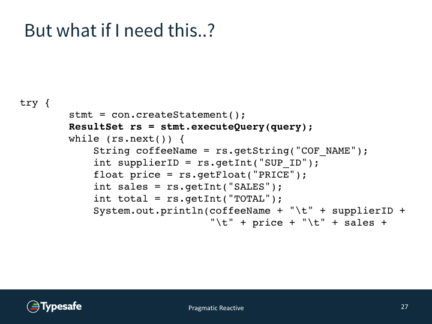

I need to do database access. I want to use a relational database, I need to use JDBC. There's no asynchronous JDBC right now. If you use JDBC, that's going to be a blocking call. 

So how do we handle this in a pragmatic fashion? The non-pragmatic way would be "don't do it", use something else, use Cassandra or MongoDB or whatever. But we want to be pragmatic, and we say, ok, it's going to happen, or it should be possible to use a relational database, as we did before, in the past.
So isolate your threads!

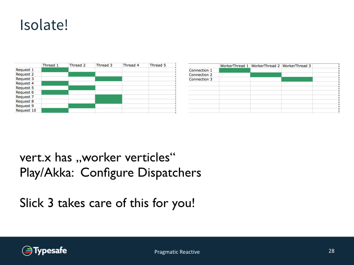

What you can do, and you can do that very nicely in Play and Akka, is to define different dispatchers for different tasks. So you can have your main dispatcher for the incoming requests, and CPU bound work, and just reserve a different thread pool for the blocking I/O. Conveniently, Slick 3 will actually do that for you. Slick will give you an asynchronous API on top of JDBC. Internally, it's basically how it works, it uses its own ExecutionContext and uses a number of threads, that you can of course configure, independently of the rest of your application.

So, what we've learned so far:

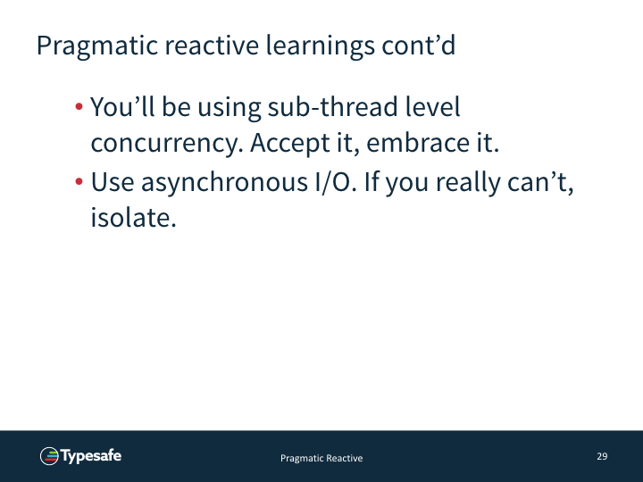

You'll be using sub-thread level concurrency anyway, and you don't want to use blocking I/O. Use non-blocking I/O, and if you really can't, if you really have to do a blocking call because you want to use JDBC, then just isolate that and use a separate thread pool.

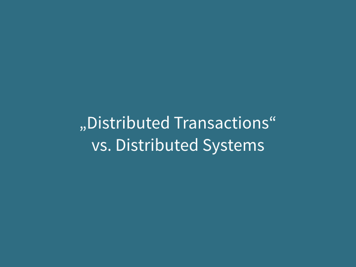

And now to the title topic of the talk...

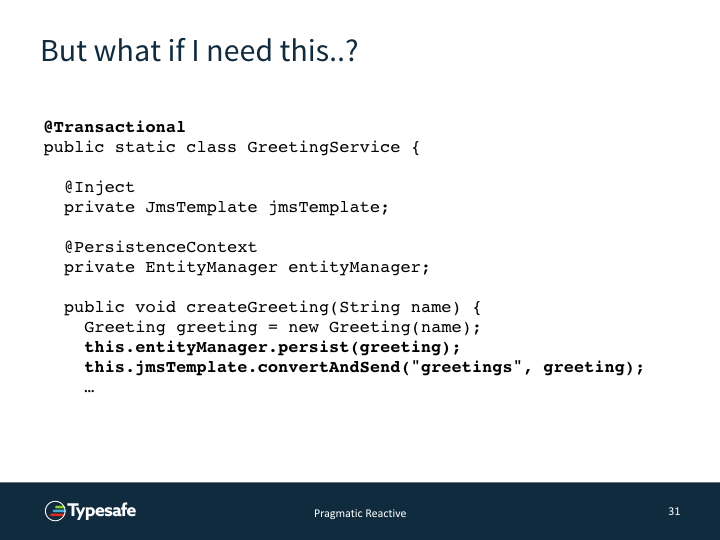

...what if we go beyond that, what if we don't only have a database access, a JDBC call where we do a select as we did in the previous example. Here, we actually have two transactional systems, we have a message queue and a database, within one transaction. In this case I think this is some Spring example code, in Java obviously, that makes it pretty easy, right? I have to define a transaction manager somewhere, but once I have this, if I have a transaction manager that's capable of handling distributed transactions, this is all I have to do, to have this all-or-nothing approach. So in an asynchronous system, where I actually want to avoid blocking I/O even, how could I possibly do something like this?

The answer of course is indeed: You don't really want to. But well being pragmatic, if my requirement is all-or-nothing, how do I handle that?

So this is a bit of a local color here, this is German, I don't know the English equivalent for that, but I like these three steps: Avoid, separate - so this is about trash, household trash: You should avoid it, if you can't avoid it, separate it, if you've nicely separated you can recycle it.
I'm not saying distributed transactions are trash, I'm saying it's interesting to look at these three steps. Avoidance, separation, and if you really can't do anything else, recycling.

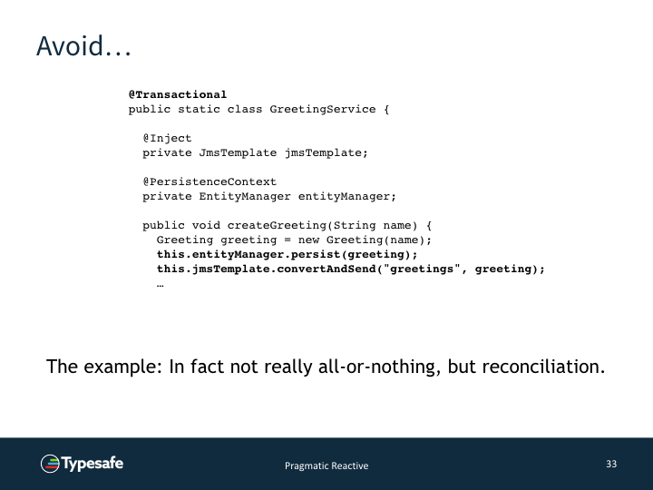

Avoiding. So this example is actually, in this context.. it's just something I copied from the internet. But also, I've seen this in real world projects - exactly this combination, a message queue and database access. Well, distributed transactions or two-phase commit or what have you, what is it about? It's really about all-or-nothing, right? You don't want a two-phase commit, what you want is this all-or-nothing guarantee. I have two seperate actions, I want to write in database A and database B or whatever, and you want it either all to happen, or nothing at all. Now if we look at this example, this is actually not even that. It's not even all-or-nothing, because we don't know what's at the receiving end of the queue, right? 
It doesn't give you any guarantees that the data you put on the message queue is going to be processed correctly on the other end. All it guarantees you is, if your local transaction has worked (in this case I consider the database transaction the local one, it's your local database, and then there's some other system, somewhere else, where you want to send a message to) ...

This is really not all-or-nothing, and this is the first step you should take in approaching this: If in your requirements, or user stories, you have this all-or-nothing situation, and they say we need to insert it into the database and we need to send it to this other system, you really have to challenge that and have to say, is this really an all-or-nothing situation, or?
In this case, I would call that reconciliation. You insert it into your database and you just want to make sure that another system reconciles with that and takes up these changes as well. So I think in this particular case, if you have this combination of a local database and a messaging queue, I would advise to really separate that and to do the operation in the local database in a way that you mark, if it has been transferred to the other system or not. And then you can easily have a completely different process that does the reconciliation and makes sure the data is sent to the other system, but completely asynchronously. 
So my advice would be first try to avoid it. Try to identify if it's really necessary, the all-or-nothing, or if it's maybe just because it seemed easy to do it, and don't do it.

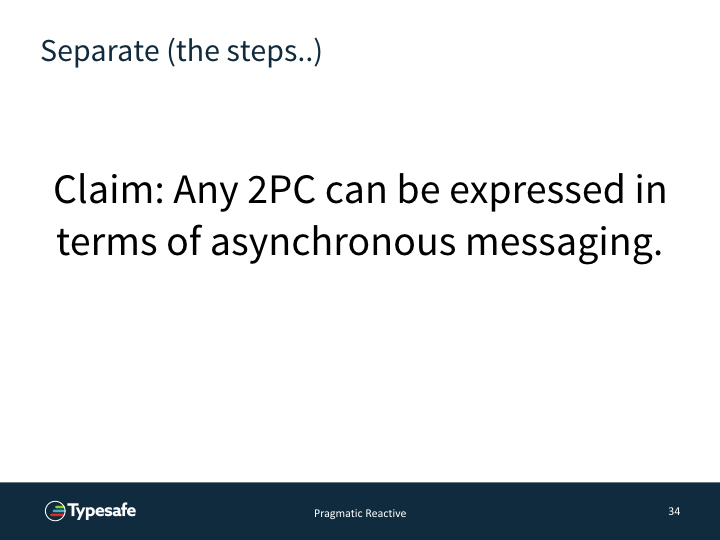

But of course we want to be pragmatic, and not principled, so in a pragmatic fashion one could say I still want to be able to do it, or I might still have this requirement. 
And now it becomes a bit more work. The basic idea is, you can achieve the same effect, you can get the all-or-nothing also with asynchronous messaging. 

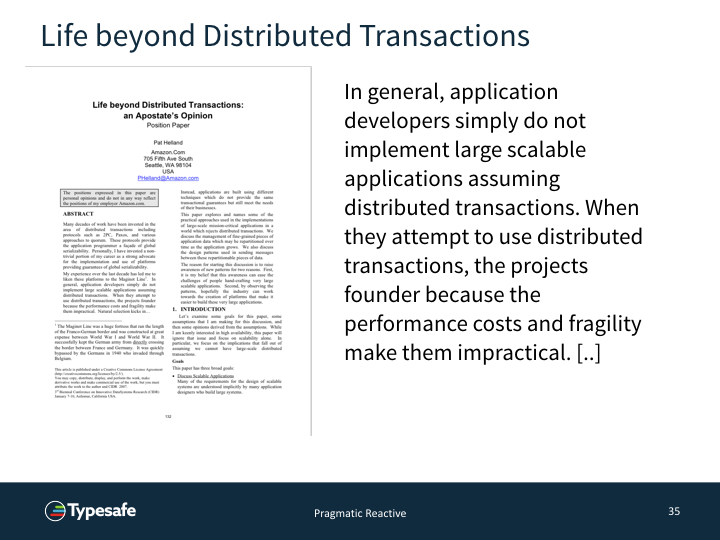

For me, the principal explanation is from this paper, this is like a very general consideration how to achieve that. This is by Pat Helland, "Life Beyond Distributed Transactions", and it's also a very funny paper, well, geek-funny, not super-funny. He's very opinionated. If you look at slides from him, he's like

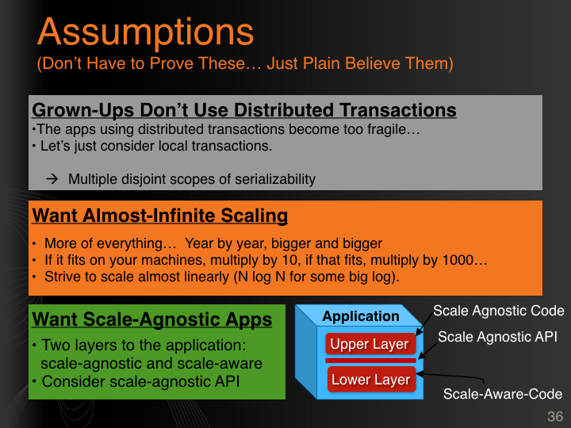

"Grown-Ups Don't Use Distributed Transactions". And "Distributed transactions don't scale, don't even try to argue with that, just believe that." Oh, well, that might be also worth considering: So a 2-phase-commit with a transaction coordinator is not good in a distributed system. That may be something we should make ourselves aware of first - why do you even not want a distributed transaction in a traditional sense?

Well, if you think of the reactive traits - we want to be scalable, or elastic, and resilient - this whole concept of a synchronous 2-phase-commit is really not made for that. Even in the Oracle Transaction Manager documentation it says something funny about "the commit point should be a system with low latency and always available" or something like that.
Because it will really break if one of the - in any step - it's also a multi-phase process, right? You get the prepare calls to each of the parties that are involved in the distributed transaction, and then you have the actual commits or rollbacks. And at any point in the sequence we should be.. well, it doesn't really account for the ability of the systems to fail. And of course the latency will hold you back as well. It's a natural point of contention and failure.
I think actually it was more an observation than a principled thought to say, we see when we build highly scalable systems that people just don't use that. 

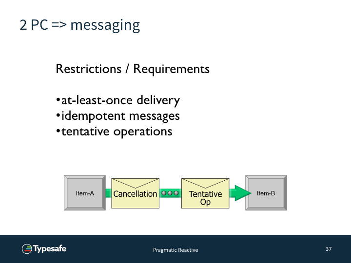

So I said you can in principle replace any 2-phase commit with messaging.

Well of course it's not that easy. You can't just say ok I'm just going
to use an actor and send some messages and that's going to be like a two-phase
commit.
You need some restrictions there. You need to do some work. You must make
sure that the message arrives at your destination. So you need at least-once delivery. That's not the standard if you just use Akka without persistence, just in-memory, there you have the at-most-once delivery, right? 
You send a message that might - you are sure it's not going to arrive more than once.

 but that's not a good guarantee for a, you know to model an all or nothing scenario.

 What want really is atleast once delivery and you can't guarantee the message order, right?
  And multiple delivery, you might have multiple deliveries of messages, so you need to make your messages idempotent, or you have to handle some other -   this is very compact way of
saying it making your messages idempotent - you have to be able to handle
multiple deliveries of messages and out of order delivery of messages.
Aand lastly, well you have to have rollback ability. You have to have an idea of a
tentative operation.  I think  the textbook example is a hotel reservation.

So the idea is the send out this request you know
it's going to get there some time - it's at-least-once delivery -  and say I want to book this hotel room. And now you have to have the concept of this being tentative. You say I reserve this, and this is going to be valid for a certain time
until it's acknowledged or... it's reversible. So either it's going to be acknowledged at some point in time - of course the way you communicate with messages is that you send a message and you get an acknowledgement back - so either it going to be acknowledged at
a certain point in time or I have to reverse that.

So it's not - I don't have a simple flip-switch solution, like this is the code how you do .. this is the distributed transaction, now you just automatically transform the code and send some messages, and now you have this in an asynchronous, distributed manner. It will actually affect your modeling, you'll have to think about the messaging you do, and about your process. But it should be possible.

Now, yeah, I would stop there and say: Ok, this is how you do a 2-phase-commit in Akka, or how you do all-or-nothing in Akka. Maybe, ok, but now maybe some of you are going to say: But that's not pragmatic enough. That's very principled, you say, oh you know any 2-phase-commit can be replaced by asynchronous messaging, and at-least-once delivery and idempotent messages.

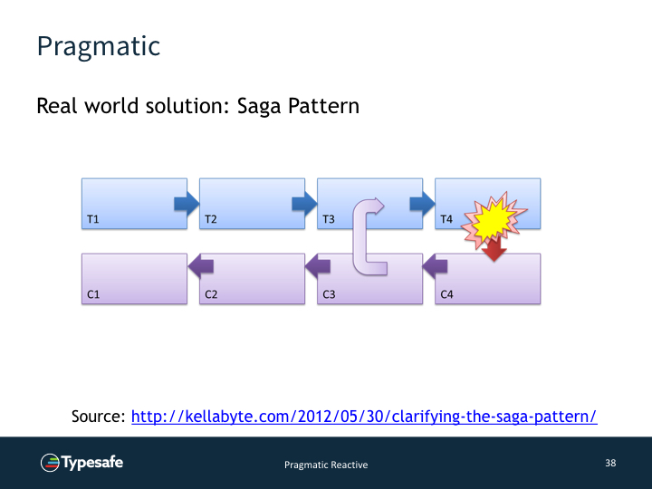

So a real world, I think  a pragmatic approach how it's actually being done in the real world would be the saga pattern. In the
saga pattern, you start a story, you start a saga, and each of the steps, each of your single commits has a counterpart that will reverse the operation, right? So say T1, T2, T3 are transactions and the  seemed C boxes here are compensating actions. So
you start a saga and you say, book a hotel room, reserve a car.. as it happens there will be an example right here, a stolen one I must admit.

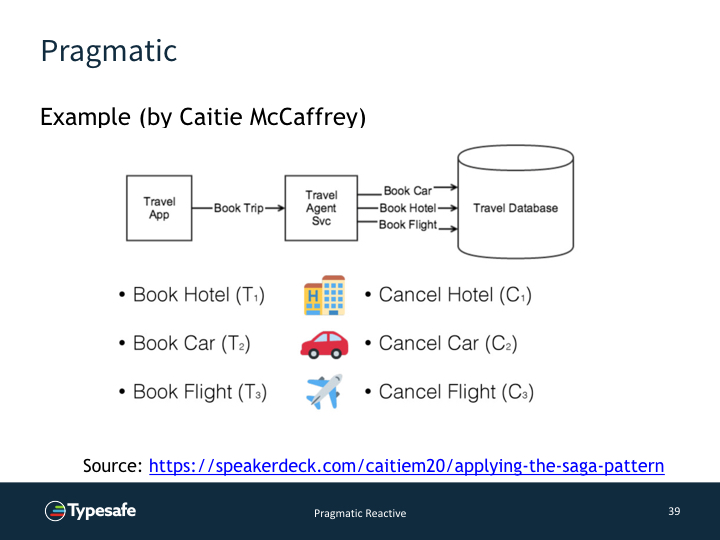

So the transaction will be to book the hotel, and the compensating action would be to cancel the hotel. You book the car, you cancel the car, you book the flight, you cancel the flight.

So this is not built-in in Akka, and actually I haven't even seen a reference implementation of this in Akka so far. But it's been done in other contexts. And what you have to do, is you
have to have a saga execution coordinator

 So you have to have somebody who takes care of recording these actions, these transactions, and making sure, well, either at the end to say, "ok, this saga has been successfully completed", or make sure that the compensating actions are executed. 

 So it needs to be, it needs some durable log, the saga log, 
 and also here you'll find  the ideas from the  principled approach back in here. So having a compensating action corresponds to the idea of
having a tentative action, right?

Booking the hotel is tentative in the sense that it's reversible, I can have a compensating action that will take this back, at least until the saga is completed. You need the at-least-once messaging and the ability to handle multiple messages, or the out-of-order messages, in the compensation phase. You must make sure, you must guarantee that the compensating message will be delivered at least once, otherwise you can't guarantee the all or nothing approach.

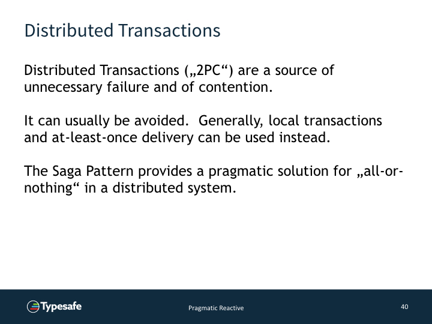

So what we would learn from this. Distributed transactions - I'm going way fast, I'm almost through here and we still have so much time left, well, we'll see -  distributed transactions are a source of contention and of failures, you should definitely avoid distributed transactions, and many people will say so.  
Local transactions are fine, I think the saga pattern is actually a good, pragmatic solution for having an all-or-nothing approach in a distributed world. If you go to a different approach, from a scalability and flexibility point of view I think this whole Event Sourcing thing corresponds very nicely with reactive applications.

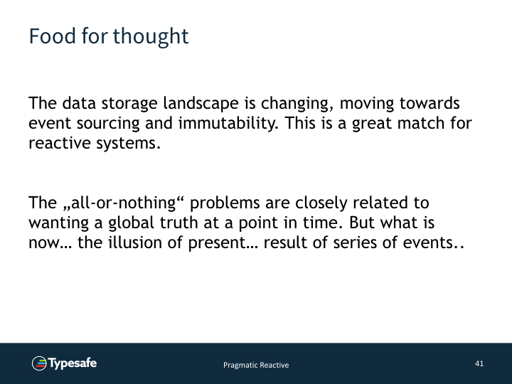

Also looking a bit ahead, we see now a lot of systems that don't use a central database with mutable state at all anymore. They use a different approach, like Event Sourcing.
A lot of these all-or-nothing problems, they stem from the fact, from the idea that you have this mutable data store where you have the single source of truth at any point in time.

And also, if you've seen the keynote by Jonas Bonér, this whole.. it's also a very principled question if you really want this, or if it's a meaningful idea to have a global truth at a certain point in time. What is the present, what is now? If you think of the present being a consequence of the events, thinks like that, I think it questions the whole concept of having a central, global truth data store. So this goes a bit beyond that pragmatic thing, maybe. I think the good news is, we're going to build systems differently anyway, and we don't worry so much about 2-phase-commits and stuff like that anymore then.

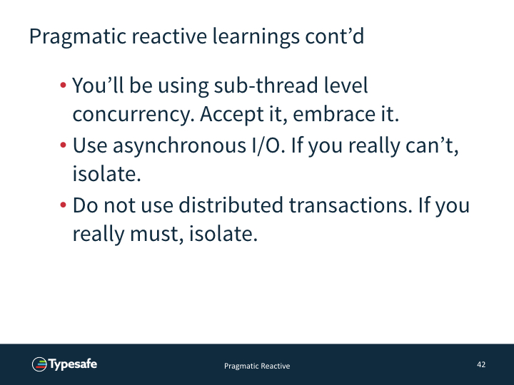

So the pragmatic reactive learnings. We're going to use sub-thread concurrency, we're going to use asynchronous I/O, do not use distributed transactions. 

Oh, the last thing about the distributed transactions I didn't even mention. So I said there would be a layered approach, a 3-layer-approach:
Try to avoid them, question the requirement, see if it really is an all-or-nothing, or if it's just some system reconciliation.
If you can't do that, then you can refactor it, if you have idempotent messages, and at-least-once-delivery, which Akka persistence would give you, and have some concept of tentative operations, then you can achieve the same all-or-nothing in a distributed fashion, or you can use, as a more specific example, you could use the saga pattern to achieve that.

Of course the third would be just to leave it as it is. You can isolate this just like you isolate the synchronous I/O, right? You can put this on a different thread pool and you can put your whatever you want to process in a queue and have this processed asynchronously from the rest of your application. But of course your going to pay a price for that. 

You will not achieve the same resilience, or the same scalability, elasticity as you would with a refactored solution.

But it's always a trade off, right? If you say ok, for some reason this real, I really have this ACID consistency, strong consistency requirement and I need this 2-phase-commit there, then it's always a possibility to live with that and have to trade off.
Trade off availability for consistency in this case. 

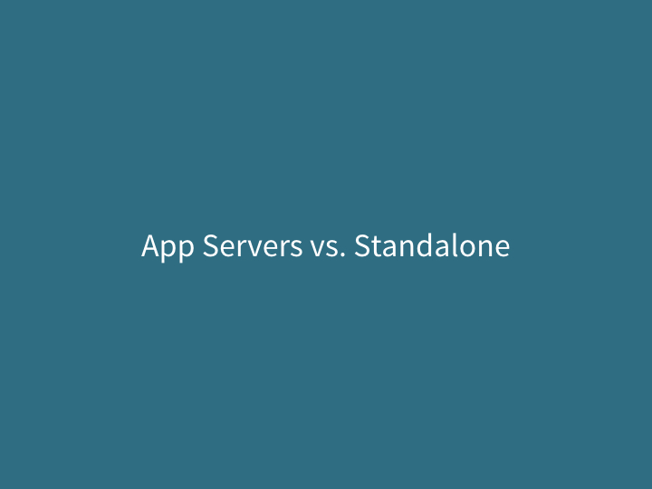

So these where actually the main points I wanted to get across.

As a little bonus another a question we often get is about deployment, really. So how, if I built an Akka application or Play application, can I deploy that on my, whatever, Java Enterprise Edition Server, or on my Tomcat or Jetty or whatever.

So it's not really related to the whole concurrency and asynchronous idea but I would argue that reactive applications will be standalone applications, or containerless applications.

I really like this talk, from a while, a year ago or so: "Application Servers are Dead" and he created a lot of content around that. 

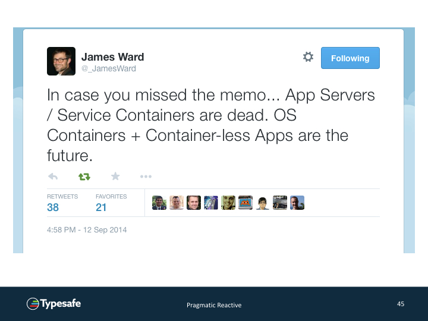

And also my former colleague James Ward said: If you still think you want to use containers, like, service containers to put your services in, you probably missed the memo, because nobody is doing it anymore, everybody is dockerizing their stuff, and building little standalone stuff.

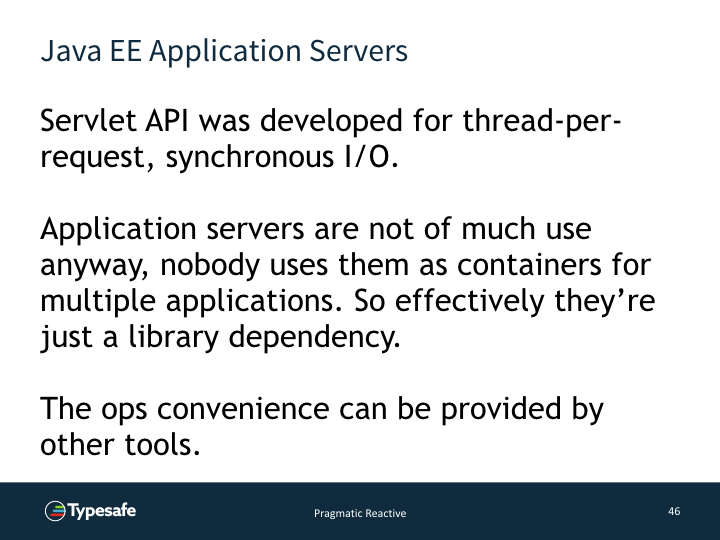

So why the backlash against application servers? 

The idea of the application server ... well first of all from a technical point of view, if you use a Java EE application server, you're going to use the Servlet API. The Servlet API is - barring some recent additions that haven't really become popular so far - is a synchronous API, right?
You get in a request and then the idea is to process it synchronously, and blocking and all that stuff as we saw with the thread-per-request model. The Servlet API is built for the thread-per-request model. So we don't want that. So this is a technical reason, a low-level technical reason not to use them.
Another reason is the benefit we get from the application server. It adds some complexity, I have to buy it, I have to install it, I have to operate it, what does it give me? It gives me some APIs. The idea is to have a container where I can put in a number of services, I put in a number of .wars for differnet applications - nobody does that in reality, though. The value of isolation or, in all the projects I know at least, the value of isolating your systems and making sure that a crash of one will not affect the others, or an immense load will not affect the others, is much higher, the value of that is much higher than the value of being able to deploy a couple of applications on one server. So what people do is, they take one application per application server instance. You'd rather start a couple of Tomcats with one application in it than one Tomcat with ten applications in it. 

If you only deploy one application per Tomcat - Tomcat now just being an example - then, what Tomcat really becomes is just a library that you add to your application, right? It's just the way of delivering that, instead of not wrapping it together and just building a .war and putting it somewhere, you could wrap it toghether and just build one binary out of it. This is one Spring Boot does, right? Spring Boot just gives you a standalone .jar that you can run, and it just puts the Tomcat, or the Jetty, or the Undertow, or what you want to have, in there.
Well, if it's just a library, why not just use a library, why use the application server? Then you can just use an HTTP library, like we do in Play, and you get the better of it.

There might be some ops convenience, so from the operations point of view people might like that. I actually know a company that uses Akka, they don't use Tomcat at all, but they still deploy it as a .war file and it has to run in a Tomcat - they just use the ServletContext or what it's called, fired up at the beginning, to start up their Akka actor system and stuff, and nothing else of the Tomcat is used. But they have to, because their ops people require them to, everything they do has to run in a Tomcat.

So there's some ops convenience maybe related to this thing, but there are other tools I think nowadays that you can use to conveniently deploy small services and operate them. I don't want to mention ConductR but that would be one of them.

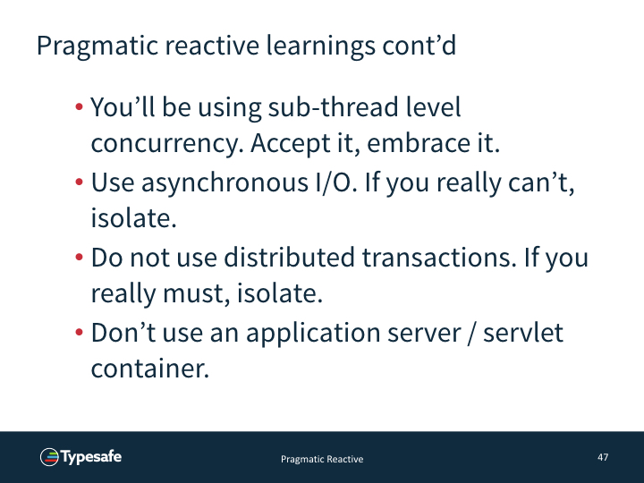

So, to wrap up our pragmatic learnings:

- You're going to be sub-thread level
- You want to use asynchronous I/O. If you really, really can't, at least isolate your stuff if you have synchronous I/O.
- You don't want to use distributed transactions, they're fragile, they're points of contention. You want to use, if you use all-or-nothing, you want to use a different model, you want to use something like the Saga Pattern, based on messaging and asynchronous back-and-forth, and
- You don't want to use an application server, you don't want to deploy there.

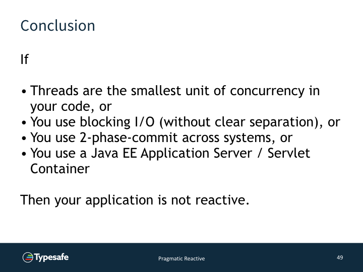

Right. If you want a checklist for your code - this is really what I wished for at some point in time, I wanted to look at stuff and wanted to be quickly able to see, is this what I thought I should build or not. 

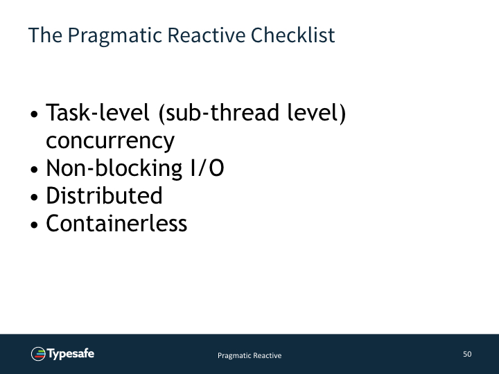

Or the other way around, in a positive list, a positive checklist would be just the four things I just mentioned, I'm not going to repeat them. 

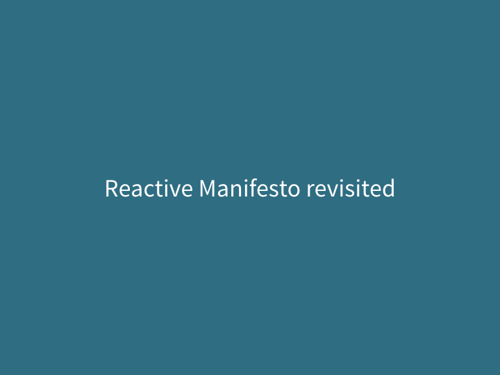
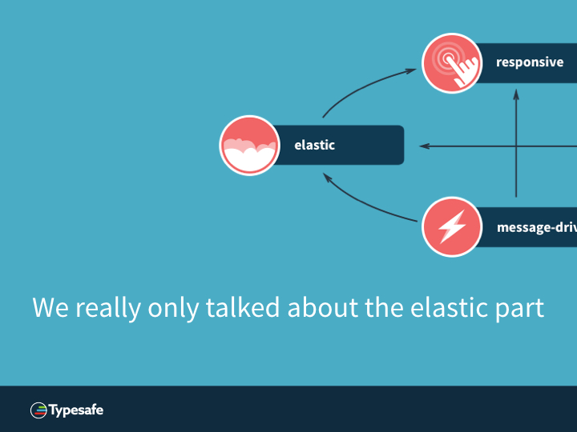

Now, in the beginning, it may have sounded as if I didn't like the reactive manifesto, because I said the reactive manifesto is just marketing, and I think we should have the pragmatic reactive manifesto. That's not actually the case. If you think about what we talked about here, we really only talked about this part, about the scalability or elasticity part. I think, to be elastic, these four things I mentioned are things you have to do.  

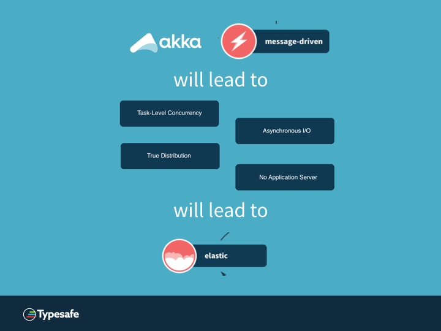

But.. so what we did, if you look at the pragmatic part, it's not an alternative, it doesn't cover the same goals as the reactive manifesto. I'm just saying, from a pragmatic point of view, if you want to talk about "elastic, what does it actually mean", I think these four traits that I mentioned would be the answer. 
And talking about the big leap between the three very conceptual things and the message-driven at the bottom: If you actually use Akka, and thereby use a message-driven architecture, all these things I mentioned,  will actually come to you. You'll work with actors, so you'll automatically have the sub-thread level concurrency, you will use asynchronous I/O most probably with Akka, or at least isolate it in separate actors with separate dispatchers. And you'll probably a truly distributed system and not deploy it in an application server.
So what I'm trying to say is, after giving it some more thought, I actually think the reactive manifesto is great, and I just try to fill in a gap there and try to explain why message driven leads to elastic systems, and what it'd look like in a very pragmatic fashion.

(*) I used to call this "containerless", because of servlet containers. But now if I say containerless, people think I argue against Docker. It's not about containerization and Docker (which is fine), it's about servlet containers and application servers (which are not).

